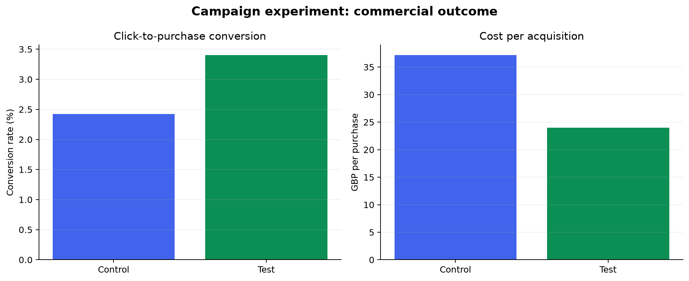

# Marketing Campaign A/B Testing Analytics

End-to-end marketing experiment analysis that compares control and test campaigns, validates funnel data, measures conversion and acquisition cost, tests statistical significance, and translates the evidence into a budget decision.

## Business Question

Should the marketing team move budget from the control campaign to the test campaign without increasing acquisition cost?

## Executive Result

In the reproducible demonstration, the test campaign increased click-to-purchase conversion from **2.42% to 3.40%** (about **40% relative lift**) and reduced CPA from **GBP 37.16 to GBP 23.96** (about **36% lower**). Both effects were statistically significant at the 5% level. The recommended decision is a staged budget rollout with a CPA guardrail rather than an immediate full switch.

> These figures come from the included synthetic demonstration data and show the decision workflow, not real commercial performance.



## What This Project Demonstrates

- Marketing funnel analysis from impressions to purchases
- A/B testing with Welch's two-sample t-test
- CTR, conversion rate, CPC, and CPA measurement
- Data validation and reproducible ETL-style processing
- SQL scorecards and daily experiment monitoring
- Dashboard-ready outputs and an executive recommendation

## Repository Structure

```text
data/raw/                  Campaign-level input data
data/processed/            KPI tables and statistical test results
dashboard/screenshots/     Recruiter-facing experiment visual
docs/                      Data dictionary, setup, and recommendation
sql/                       Campaign scorecard queries
src/                       Data generator and analysis pipeline
tests/                     Data-quality and KPI unit tests
```

## Run Locally

```powershell
pip install -r requirements.txt
python src/generate_demo_data.py
python src/analyse_campaigns.py
pytest -q
```

## Key Outputs

- `campaign_summary.csv`: executive campaign scorecard
- `statistical_tests.csv`: effect size, p-value, and significance flag
- `campaign_daily_metrics.csv`: dashboard-ready daily KPIs
- `experiment_recommendation.md`: decision, rollout action, and caveat

## Dataset

The workflow matches the public Kaggle **Marketing A/B Testing** campaign structure. To keep the repository fully reproducible and licensing-safe, it includes synthetic demonstration data and instructions for replacing it with the Kaggle files.

## Portfolio Relevance

This project provides direct evidence for CV claims around campaign analysis, conversion funnels, A/B testing, SQL/Python pipelines, data validation, dashboards, and stakeholder recommendations.

## Suggested GitHub Topics

`marketing-analytics`, `ab-testing`, `campaign-analysis`, `conversion-funnel`, `python`, `sql`, `data-analysis`, `statistical-testing`, `power-bi`
